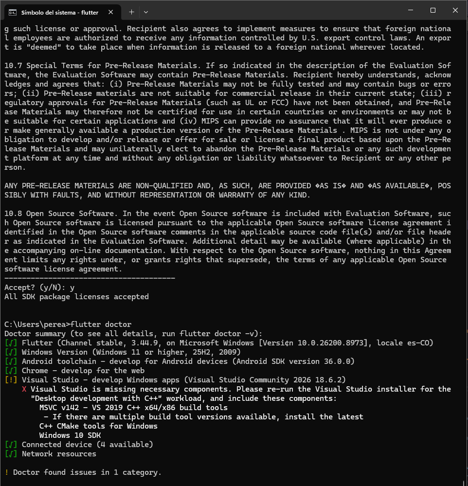

# mi_primer_app

Proyecto inicial de Flutter creado con `flutter create`.

## Descripción

Esta aplicación es el proyecto base generado por Flutter. Incluye una pantalla principal con un contador y un botón flotante que incrementa el valor cuando se pulsa.

## Requisitos

- Flutter SDK compatible con `sdk: ^3.12.2`
- Dart 3
- Android Studio, VS Code u otro editor compatible con Flutter

## Cómo ejecutar

1. Abre la terminal en la carpeta del proyecto.
2. Ejecuta:
   ```bash
   flutter pub get
   flutter run
   ```
3. Selecciona el dispositivo o emulador donde quieras ejecutar la app.

## Archivos clave

- `lib/main.dart` — código principal de la aplicación.
- `pubspec.yaml` — dependencias y configuración del proyecto.

## Notas

- Este proyecto aún no contiene funcionalidades personalizadas: es un punto de partida para seguir desarrollando.
- Puedes cambiar el título, el color del tema y agregar nuevas pantallas a partir de la base actual.

## Imágenes




