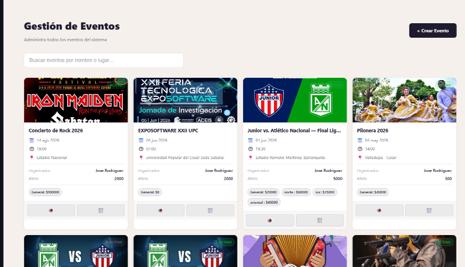
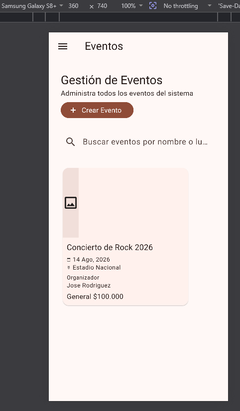

# Ticked

Aplicacion Flutter para gestion de eventos: consulta de eventos desde datos locales en JSON, y un clon de la pantalla administrativa "Gestion de Eventos".

## Descripcion

El proyecto tiene dos partes:

1. **Modelo de dominio (E02):** lista de eventos cargados desde `assets/data/eventos.json`, con entidad `Evento`, objeto de valor `Ubicacion` y estados sellados `EstadoEvento`.
2. **Clon de pantalla (E03):** replica de la pantalla administrativa "Gestion de Eventos" del panel de Ticked, con sidebar de navegacion, buscador y tarjeta de evento.

**Demo en vivo:** https://kevinperea-uni.github.io/ticked-app/

## Tecnologias

- Flutter
- Dart
- Material Design
- JSON local

## Estructura principal

```text
lib/
├── main.dart
├── core/
│   ├── json.dart
│   └── design_tokens.dart
└── features/
    └── eventos/
        ├── data/
        ├── domain/
        └── presentation/
            └── pantalla_gestion_eventos.dart

assets/
└── data/
    └── eventos.json

docs/                 # build web publicado en GitHub Pages
```

## Requisitos

- Flutter SDK compatible con `sdk: ^3.12.2`
- Dart 3
- Android Studio, VS Code o un emulador/dispositivo disponible

## Como ejecutar

1. Entra a la carpeta del proyecto.
2. Instala dependencias:

```bash
flutter pub get
```

3. Ejecuta la aplicacion (movil/escritorio):

```bash
flutter run
```

4. Selecciona un emulador o dispositivo conectado. Para ver el clon de pantalla en el navegador:

```bash
flutter run -d chrome
```

## Validacion

Para correr las pruebas:

```bash
flutter test
```

Para revisar que el codigo no tenga advertencias:

```bash
flutter analyze
```

## Caracteristicas

### Modelo de eventos (E02)

- Lista de eventos cargados desde JSON
- Vista principal con `ListView`
- Informacion de ubicacion y estado del evento
- Indicador visual cuando un evento tiene afiche
- Tema base con color naranja

### Clon de pantalla "Gestion de Eventos" (E03)

- Sidebar con perfil de administrador y navegacion
- Encabezado con titulo y boton "Crear Evento"
- Barra de busqueda
- Tarjeta de evento con imagen, fecha, ubicacion y organizador

## Comparacion visual (E03)

| Original | Clon |
|---|---|
|  |  |

## Decisiones de diseno (E03)

- **`LayoutBuilder` + `Drawer`:** el sidebar fijo (220px) solo se muestra en pantallas anchas (720px o mas). En pantallas angostas se oculta detras de un `Drawer`, evitando el error `RenderFlex overflowed` que aparece al forzar un sidebar fijo en poco espacio.
- **`Wrap` en el encabezado:** titulo, subtitulo y el boton "Crear Evento" se acomodan en la misma linea si caben, o el boton baja a la siguiente linea si no, en vez de comprimir el texto letra por letra.
- **`SingleChildScrollView`:** el contenido puede desplazarse verticalmente en vez de desbordarse cuando no cabe todo en la pantalla.
- **Sin valores crudos:** todo el espaciado sale de `lib/core/design_tokens.dart` (escala de 4, 8, 16, 24, 32, 48 px) y todos los colores y tipografias salen de `Theme.of(context)`, nunca de `Color(0x...)` escritos a mano.
- **Widgets extraidos:** `_Sidebar`, `_PerfilAdmin`, `_NavItem`, `_EncabezadoEventos`, `_BarraBusqueda`, `_EventoCard`; ningun `build()` supera las 60 lineas.

